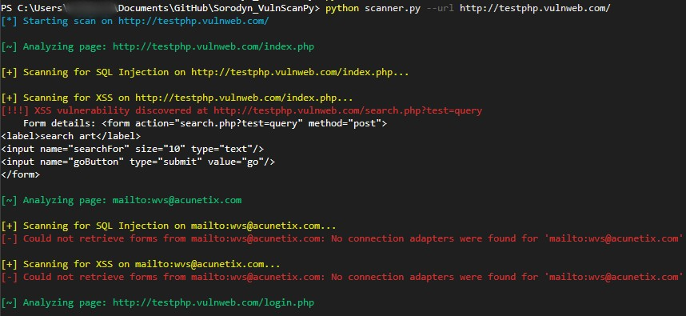

# Sorodyn_VulnScanPy - A Basic Web Vulnerability Scanner :D

Sorodyn_VulnScanPy is a simple web application vulnerability scanner written in Python. It's designed for educational purposes to demonstrate how scanners crawl web pages and test for common security flaws like SQL Injection (SQLi) and Cross-Site Scripting (XSS).

## Features

-   **Web Crawler:** Discovers all unique links on a target website.
-   **SQL Injection Scanner:** Tests web forms for basic SQLi vulnerabilities.
-   **XSS Scanner:** Tests web forms for basic Reflected XSS vulnerabilities.
-   **Professional CLI:** Uses `argparse` for arguments and `colorama` for clean, colored output.

## Disclaimer

⚠️ **This tool is for educational purposes only.** Only run it on systems and applications for which you have explicit, written permission to test. Unauthorized scanning is illegal.

## Installation

1.  Clone the repository:
    ```bash
    git clone https://github.com/213974/Sorodyn_VulnScanPy.git
    cd Sorodyn_VulnScanPy
    ```
2.  Create a virtual environment:
    ```bash
    python -m venv venv
    ```
3.  Activate the virtual environment:

    *   **On Windows (PowerShell):**
        You may need to adjust your execution policy to run the activation script. Run this command first to allow scripts for the current session:
        ```powershell
        Set-ExecutionPolicy -ExecutionPolicy RemoteSigned -Scope Process
        ```
        Then, activate the environment:
        ```powershell
        .\venv\Scripts\activate
        ```

    *   **On Windows (Command Prompt - CMD):**
        Activation is simpler in CMD and does not require policy changes.
        ```cmd
        .\venv\Scripts\activate
        ```

    *   **On Mac/Linux:**
        ```bash
        source venv/bin/activate
        ```

4.  Install the required dependencies:
    ```bash
    pip install -r requirements.txt
    ```

## Usage

Run the scanner against a target URL. For a safe and legal test, you can use `http://testphp.vulnweb.com/`.

```bash
python scanner.py --url http://testphp.vulnweb.com/
```

### Example Output
